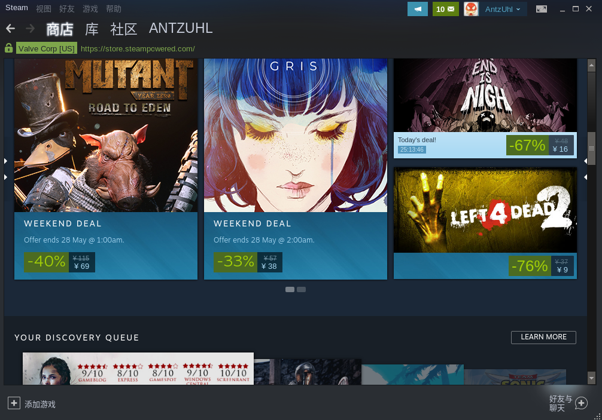

 

# 一次Deepin深度之旅

几天前，我觉得电脑上文件太乱了，就把电脑上`Ubuntu18.04`和`Windows10`两个系统一起卸载了，重新安了双系统。之前主要用的是Win10，因为很多编程环境我都已经配置好了，在Ubuntu上也就只牵扯一些安卓开发以及Linux Shell相关的东西。这次在挑选Linux系统时，我直接跳过`Ubuntu`系列，理由是用了好几年，那个黑粉色真的接受不了了...(不过18.xx开始还是比较美观的)，再说`Kali`系列，之前在实验室电脑上装了，用了2~3个月，个人觉得除了借助里面的工具对局域网下其他人的网络进行攻击(当时抓别人聊天的图片，抓下来全是广告)以外对我没有任何帮助。`Centos`系列因为在用他们的服务器，所以没有多大兴趣，不过当时搜索时发现了一个桌面版为主的Linux系统`Deepin`，看了一眼网上的图，就决定是你了！

安装使用到现在刚3天，先来说说体验。界面确实很不错，而且提供的软件服务都很人性化，打开软件商店就可以发现很多`Win`下的软件都可以在这里找到，系统自带了QQ，网易云音乐，WPS等软件，刚开始的时候还是很惊讶的，因为当初这些软件都花了我多精力才在Ubuntu上安装上，但是当我点击运行的时候就懵了，这些都是基于`wine`容器的。

 


当初就是`wine`，让我有一天开机的时候Ubuntu上出来了`一份360全家桶`，很多捆绑软件都可以通过它来进行传播，当然这不能成为拒绝wine的理由，但是wine有一个问题，在这个容器中运行的软件，如果出现问题，会由系统来承担，也就是你的Linux可能会出问题，举一个软件开发的例子，两个人负责一个系统中两个衔接模块，当A的系统需要调用B时，A中的异常应该怎么处理，这个时候最好的方法就是不要去理它，`直接抛出，交给上一层去处理`。

除了`wine`，`deppin`自带的显卡驱动更是问题不断，一个是视频播放的时候会不定时假死，屏幕不动，另一个就是玩游戏会卡死。(Linux能有多少游戏，不过它的软件商店起码比较丰富，Steam，斗地主，还有一堆上世纪游戏)。

 


不过要解决显卡问题也很容易，只需要下载一个显卡驱动管理器就可以了。


使用NV-PRIME方案，这种方案使用效果目前感觉很好，不过我估计耗电会较大。


此外还有很多系统相关的工具，可以在商店找到。


总结一下`Deepin`的使用体验在我认为就是`接近MacOsd的美感`与`花样百出的Bug`。

再说安装这个双系统时遇到的问题。

第一个大问题就是在安装界面没有`选择启动引导器`的选项，在安装之前我电脑已经有了一个`Windows10`，我的第一感觉就是这个Win10要没有了，安装完成后，重启，果然在GRUB引导界面没有了Win10，只有`Deepin`一个系统选项。百度之后找到了一个检索GRUB引导的命令，可以查找Win10所在的位置。

```
sudo update-grub
```

进入Deepin执行这个命令之后，重启，在引导界面终于出现了两个系统，Deepin和Windows10。(不得不说Deepin的GRUB很好看)

另一个问题就是Deepin的安装分区那个部分，不能对已有的分区进行拆分，只能格式化。当时给Deepin准备了200G硬盘大小，直接是一个分区，想在安装的时候拆分成8G交换分区，剩下的全部挂载到`\`上。但是却发现拆分不了，只能暂时不要交换分区`Swap`了。(后来自己加了一个，除了在安装时设置，也可以之后自己手动设置)


短期之内应该会一直使用这个系统，相比于Ubuntu启动时的磁盘检查，Deepin虽然不是很严谨，但是快就完事了。而且它的应用商店可以满足大部分的软件需求，并不用担心Windows平台的事情它做不了。


