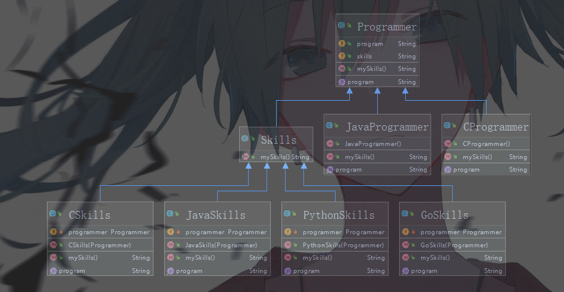

## 设计模式—装饰者模式

装饰模式是对继承的补充，继承不是万能的，在实际的项目中，需要考虑到项目的维护性,扩展性,复用性。而且某些情况下继承会增加很多子类，灵活性非常差。

装饰者可以代替继承，解决类膨胀问题，而且继承是静态地给类增加功能，装饰者是动态地给类增加功能。

在实际的项目环境中，假设有三个继承关系的类，`Father`,`Son`,`GrandSon`，如果现在要求给`Son`类添加新的功能，可以直接修改`Son`中的代码吗？当然不行，这样继承它的`GrandSon`也会受到影响，而且`GrandSon`通常会有多个，这种情况下对每一个`GrandSon`进行评估都很浪费时间。

根据装饰者模式的思想，我们可以建立一个`Son`的装饰类来修饰它，相当于创建了一个新的类。

现在来模拟一个场景，有两类程序员`JavaProgrammer`,`CProgrammer`，Java程序员和c程序员。

还有多类技能,`Java`,`c`,`c++`,`PHP`,`Python`,`Go`,`JavaScript`。

来看一下UML图。



贴上代码:

* Programmer类是代表了一个程序员的抽象类


* JavaProgrammer类是指Java程序员，继承了Programmer类


* CProgrammer类是指C程序员，继承了Programmer类


* Skills类是技能的抽象类


* 表明会Java语言


* 表明会C语言


* 表明会Go语言


* 表明会Python语言


* Main函数
```java
public class Main {
    public static void main(String[] args) {

        Programmer javaprogram = new JavaProgrammer() ;
        javaprogram = new JavaSkills(javaprogram) ;
        javaprogram = new CSkills(javaprogram) ;
        javaprogram = new GoSkills(javaprogram) ;
        javaprogram = new PythonSkills(javaprogram) ;

        System.out.println(javaprogram.getProgram() + " ;;; " +javaprogram.mySkills() );

        Programmer cprogrammer = new CProgrammer() ;
        cprogrammer = new CSkills(cprogrammer) ;

        System.out.println(cprogrammer.getProgram() + " ;;; " +cprogrammer.mySkills() );
    }
}
```

运行结果：


